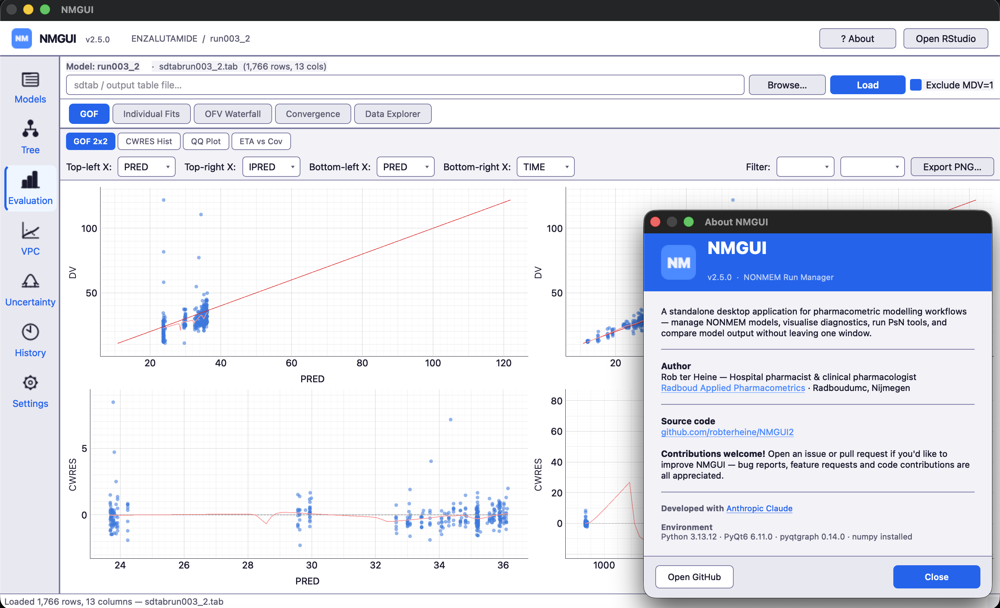

# NMGUI2

**A standalone desktop application for NONMEM pharmacometric modelling workflows**

NMGUI2 is a PyQt6 desktop application that brings together everything a pharmacometrician needs in one window: browse and compare NONMEM models, evaluate goodness-of-fit, run PsN tools, analyse bootstrap and SIR results, visualise model lineage, and read `.lst` output — without switching between terminals, text editors and R.

It runs entirely offline on macOS, Windows and Linux. No browser. No server. No internet connection required during use.



---

## Table of contents

- [Features](#features)
- [User guide](USER_GUIDE.md) — full reference for every tab, dialog, and required R/PsN package
- [Dependencies overview](#dependencies-overview)
- [Quick start](#quick-start)
- [Installation — macOS](#installation--macos)
- [Installation — Windows](#installation--windows)
- [Installation — Linux](#installation--linux)
- [First use](#first-use)
- [Updating NMGUI2](#updating-nmgui2)
- [Keyboard shortcuts](#keyboard-shortcuts)
- [Configuration files](#configuration-files)
- [Troubleshooting](#troubleshooting)
- [Contributing](#contributing)
- [Author](#author)
- [Acknowledgements](#acknowledgements)
- [License](#license)
- [Changelog](#changelog)

---

## Features

### Models tab
- Scans a directory for `.mod` / `.ctl` files and displays all models in a sortable, filterable table
- Columns: OFV, ΔOFV (relative to best or user-selected reference), minimisation status, covariance step, condition number, estimation method, individuals, observations, parameters, AIC, runtime
- Colour-coded rows: green = successful, red = failed/terminated, orange = boundary/stale
- Filter buttons: All, Completed, Failed — plus free-text search
- **Right-click context menu** on any model: run, toggle star, duplicate, set reference model, compare with another model, copy paths, open folder, view `.lst`, view `.ext`, open QC report, open run report, view run record, show NM-TRAN messages, workbench, delete (excludes dataset)
- Keyboard navigation: ↑↓ move rows, Space toggles star, Enter jumps to Output

### Model detail panel

**Parameters** — full THETA/OMEGA/SIGMA table with names (parsed from control stream comments), estimates, SE, RSE%, 95% CI, SD for variance parameters. Handles `BLOCK(n)` and `BLOCK(n) SAME` designs correctly. Export to CSV and HTML report.

**Editor** — syntax-highlighted `.mod` editor with save functionality.

**Run** — launch any PsN tool (`execute`, `vpc`, `bootstrap`, `scm`, `sir`, `cdd`, `npc`, `sse`) with custom arguments. Each run opens its own floating popup window with a live console, iteration/OFV progress indicator, elapsed timer, and Stop button (gentle SIGTERM or force SIGKILL). Multiple models run simultaneously. A **"Run detached"** checkbox (Linux/macOS) launches the job under `nohup` so it survives SSH disconnection or NMGUI2 closure — automatically pre-checked when running over SSH. The **Active & Recent Runs** table shows live, detached, and historical runs; history persists per project folder across restarts.

**Info** — comment, status tag (base/candidate/final/reject), notes — all persisted in project metadata.

**Output** — structured HTML rendering of the `.lst` file in-app:
- Summary card with key results
- **Estimation steps table** for chained `$EST` runs (e.g. FO → FOCE-I → IMP), showing per-step OFV, ΔOFV, runtime, significant digits and termination status
- NM-TRAN warnings section
- Convergence table (iteration history)
- Parameter estimates with SEs and names
- ETABAR statistics with p-values
- Shrinkage (ETA and EPS)
- Correlation and covariance matrices
- Eigenvalues and condition number
- "Open in browser" exports full HTML

### Files tab
A three-pane file browser built into NMGUI, positioned directly below the Models tab (Ctrl+2).

- **Left panel** — extension filter checkboxes pre-populated with `.mod`, `.ctl`, `.lst`, `.tab`, `.csv`, `.ext`, `.cov`, `.cor`, `.phi`. Custom extensions can be added and removed. Filter state persists across sessions.
- **Middle panel** — sortable file list showing name, size and last-modified date for all files in the current project directory matching the active filters.
- **Right panel** — content viewer:
  - Text files: monospace editor with syntax highlighting for `.mod` / `.ctl` (reuses the NMHighlighter). Inline find bar (Ctrl+F equivalent).
  - `.csv` and `.tab` files: spreadsheet table. NONMEM `TABLE NO.` header lines are automatically detected and skipped. Large files are capped at 5 000 rows.
  - **Edit / Save / Discard** for text files and `.csv` files. `.tab` files remain read-only.

### Ancestry tree (Tree tab)
Interactive node graph of model lineage based on `";; 1. Based on:"` PsN metadata or manually set parent. Zoom, pan, double-click any node to select that model in the Models tab. Visual indicators for starred and final models.

### Model Evaluation (Evaluation tab)
Comprehensive diagnostic plots and data exploration:

- **GOF 2×2** — DV vs PRED, DV vs IPRED, CWRES vs TIME, CWRES vs PRED with unity/zero reference lines
- **Individual fits** — paginated DV/IPRED/PRED vs TIME per subject, customisable columns per page
- **CWRES histogram** — with normal distribution overlay
- **QQ plot** — CWRES vs theoretical quantiles with Shapiro-Wilk test and 95% confidence band
- **ETA vs covariate** — scatter plots of ETAs against continuous covariates
- **OFV waterfall** — ranked ΔOFV bar chart across all models
- **Convergence traces** — parameter trajectories from `.ext` file
- **Data explorer** — interactive scatter plot with multi-filter capability, grouping/colouring by any column, paginated data table view

Auto-loads `sdtab` files when a model is selected. Shows truncation warning if data exceeds 15,000 rows.

### VPC tab
Generate Visual Predictive Checks via three R backends:
- **vpc** (R package by Ronny Keizer)
- **xpose** (tidyverse-based)
- **xpose4** (classic)

Features:
- Prediction-corrected VPC (pcVPC) option
- Stratification by any column with validation (checks column exists, warns if >20 levels)
- Configurable prediction intervals, confidence intervals, LLOQ, number of bins
- Log Y axis option
- Editable R script with syntax highlighting — modify before running
- Live console output during R execution
- PNG output displayed in-app
- R package availability detection on startup

### Uncertainty tab
Analyse parameter uncertainty via Bootstrap or SIR:

**Bootstrap analysis**
- Run new bootstrap via PsN or load existing results folder
- Configurable samples, threads, stratification
- Automated parsing of `raw_results.csv`
- **Diagnostic checks**:
  - Completion rate (% successful runs)
  - Bias assessment (median vs original estimate)
  - Parameter correlations
  - CI validity (does CI include point estimate?)
  - Boundary proximity warning (OMEGAs clustering near zero)
- Parameter table with 95% CI from percentiles
- Forest plot visualisation
- Overall assessment: PASSED / ACCEPTABLE / WARNING / FAILED

**SIR analysis**
- Run new SIR via PsN or load existing results folder
- Configurable samples, resamples, auto-detected degrees of freedom
- Parsing of `raw_results.csv` with resample weighting
- **Diagnostic checks**:
  - Effective sample size (ESS)
  - Resampling efficiency
  - Degeneracy detection
  - Resample distribution analysis
- Parameter table with weighted percentile CIs
- Overall assessment with interpretation

### Run History (History tab)
Full history of PsN runs with:
- Status (running/completed/failed)
- Duration
- Command preview
- Timestamp
- Click to view full run record

### Run Records (audit trail)
Every model run creates an immutable run record containing:
- Unique run ID (UUID)
- Model file SHA-256 hash (integrity verification)
- Data file SHA-256 hash
- NONMEM version, PsN version, NMGUI version
- Start/end timestamps, duration
- Final OFV, minimisation status, covariance status
- Number of individuals, observations, parameters
- Full command used

Access via right-click → "View run record" on any model. Records stored in `~/.nmgui/run_records.json`.

### Settings tab
- Dark/light theme toggle (follows system or manual override)
- Path configuration for NONMEM, PsN, RStudio
- Directory bookmarks management
- All settings persisted between sessions

### Additional features
- **Bookmarks** — save frequently-used directories for quick access
- **Model comparison** — side-by-side parameter comparison dialog with aligned rows
- **Duplicate model** — create copy with incremented run number
- **NM-TRAN messages** — quick access to compilation warnings/errors
- **Stale detection** — orange highlight when `.mod` or data file is newer than `.lst`
- **GitHub update check** — optional notification when new version available
- **Debug logging** — detailed logs written to `~/.nmgui/nmgui_debug.log` for troubleshooting
- **Cross-platform** — native look on macOS, Windows, Linux (including X11/MobaXterm)

---

## Dependencies overview

### Python packages

All Python dependencies are listed in `requirements.txt` and installed automatically:

| Package | Purpose |
|---|---|
| PyQt6 | GUI framework |
| pyqtgraph | Interactive plots |
| numpy | Numerical operations |
| matplotlib | CWRES histogram, QQ plot |
| scipy | Shapiro-Wilk test, confidence bands (optional but recommended) |

### External tools for running models

| Dependency | Minimum version | Notes |
|---|---|---|
| NONMEM | 7.4 | Must be installed and licensed |
| PsN (Perl-speaks-NONMEM) | 5.0 | Must be on system PATH |
| Perl | 5.16 | Required by PsN |

### External tools for VPC generation

| Dependency | Notes |
|---|---|
| R ≥ 4.0 | Must be on system PATH (`Rscript` command must work) |
| RStudio | Optional but recommended |
| R package: vpc | `install.packages("vpc")` |
| R package: xpose | `install.packages("xpose")` |
| R package: xpose4 | `install.packages("xpose4")` |
| R package: tidyverse | `install.packages("tidyverse")` — required by xpose |
| R package: ggplot2 | `install.packages("ggplot2")` — required by vpc/xpose |

> NMGUI2 (browsing, evaluating, comparing results) works without NONMEM, PsN, R or RStudio. These are only needed if you want to run models or generate VPCs from within the app.

---

## Quick start

If you already have Python 3.10+, Git, and optionally R/PsN installed:

```bash
git clone https://github.com/robterheine/nmgui2.git
cd nmgui2
pip install -r requirements.txt
python3 nmgui2.py
```

For full installation instructions including NONMEM, PsN, and R, see the platform-specific sections below.

---

## Installation — macOS

### 1. Install Xcode Command Line Tools

```bash
xcode-select --install
```

### 2. Install Homebrew (if not already installed)

```bash
/bin/bash -c "$(curl -fsSL https://raw.githubusercontent.com/Homebrew/install/HEAD/install.sh)"
```

### 3. Install Python 3

```bash
brew install python
python3 --version
```

### 4. Install R (required for VPC only)

```bash
brew install r
```

Or download from https://cran.r-project.org/bin/macosx/

Verify:
```bash
Rscript --version
```

### 5. Install RStudio (optional)

Download from https://posit.co/download/rstudio-desktop/ and add to `/Applications`.

### 6. Install required R packages

```bash
Rscript -e 'install.packages(c("vpc","xpose","xpose4","tidyverse","ggplot2"), repos="https://cran.r-project.org")'
```

### 7. Install Perl (required by PsN — usually pre-installed on macOS)

```bash
perl --version
```

If missing:
```bash
brew install perl
```

### 8. Install PsN

Follow the official guide at https://uupharmacometrics.github.io/PsN/install.html

Verify:
```bash
execute --version
```

### 9. Clone and install NMGUI2

```bash
git clone https://github.com/robterheine/nmgui2.git
cd nmgui2
pip3 install -r requirements.txt
```

### 10. Run NMGUI2

```bash
python3 nmgui2.py
```

### Optional: desktop launcher

Create `~/Desktop/NMGUI2.command`:

```bash
#!/bin/bash
cd /path/to/nmgui2
python3 nmgui2.py
```

Make it executable:
```bash
chmod +x ~/Desktop/NMGUI2.command
```

Double-click in Finder to launch.

---

## Installation — Windows

### 1. Install Python 3.10 or newer

Download from https://www.python.org/downloads/windows/

**During installation, tick:**
- ✅ Add Python to PATH
- ✅ Install pip

Verify in Command Prompt:
```cmd
python --version
pip --version
```

### 2. Install R (required for VPC only)

Download from https://cran.r-project.org/bin/windows/base/

During installation, tick **"Add R to system PATH"** (or add manually: `C:\Program Files\R\R-4.x.x\bin` to PATH).

Verify:
```cmd
Rscript --version
```

### 3. Install RStudio (optional)

Download from https://posit.co/download/rstudio-desktop/

### 4. Install required R packages

Open Command Prompt or RStudio and run:

```cmd
Rscript -e "install.packages(c('vpc','xpose','xpose4','tidyverse','ggplot2'), repos='https://cran.r-project.org')"
```

### 5. Install Perl (required by PsN)

Download Strawberry Perl from https://strawberryperl.com/ — this includes all required modules.

Verify:
```cmd
perl --version
```

### 6. Install PsN

Follow the official guide at https://uupharmacometrics.github.io/PsN/install.html

Verify:
```cmd
execute --version
```

### 7. Install Git

Download from https://git-scm.com/download/win

### 8. Clone and install NMGUI2

Open Command Prompt:

```cmd
git clone https://github.com/robterheine/nmgui2.git
cd nmgui2
pip install -r requirements.txt
```

### 9. Run NMGUI2

```cmd
python nmgui2.py
```

### Optional: desktop launcher

Create `NMGUI2.bat` in the nmgui2 folder:

```bat
@echo off
cd /d %~dp0
python nmgui2.py
```

Double-click to launch.

---

## Installation — Linux

Shown for Ubuntu/Debian. For Fedora replace `apt` with `dnf`; for Arch replace with `pacman`.

### 1. Install system dependencies

```bash
sudo apt update
sudo apt install -y python3 python3-pip python3-venv git curl perl
python3 --version
```

### 2. Install Qt system libraries (required by PyQt6)

```bash
sudo apt install -y libxcb-xinerama0 libxcb-cursor0 libxkbcommon-x11-0 \
    libgl1-mesa-glx libegl1
```

### 3. Install R (required for VPC only)

```bash
sudo apt install -y r-base r-base-dev
```

For the latest R version, follow https://cran.r-project.org/bin/linux/ubuntu/

Verify:
```bash
Rscript --version
```

### 4. Install RStudio (optional)

Download the `.deb` installer from https://posit.co/download/rstudio-desktop/

```bash
sudo dpkg -i rstudio-*.deb
sudo apt --fix-broken install
```

### 5. Install required R packages

```bash
Rscript -e 'install.packages(c("vpc","xpose","xpose4","tidyverse","ggplot2"), repos="https://cran.r-project.org")'
```

### 6. Install PsN

Follow the official guide at https://uupharmacometrics.github.io/PsN/install.html

Verify:
```bash
execute --version
```

### 7. Clone and install NMGUI2

```bash
git clone https://github.com/robterheine/nmgui2.git
cd nmgui2
pip3 install -r requirements.txt
```

Or with a virtual environment (recommended on systems with externally-managed Python):

```bash
git clone https://github.com/robterheine/nmgui2.git
cd nmgui2
python3 -m venv venv
source venv/bin/activate
pip install -r requirements.txt
```

### 8. Run NMGUI2

```bash
python3 nmgui2.py
```

Or if using a virtual environment:

```bash
source venv/bin/activate
python3 nmgui2.py
```

### Optional: desktop launcher

Create `~/.local/share/applications/nmgui2.desktop`:

```ini
[Desktop Entry]
Type=Application
Name=NMGUI2
Exec=/bin/bash -c "cd /path/to/nmgui2 && python3 nmgui2.py"
Terminal=false
Categories=Science;
```

---

## Updating NMGUI2

On all platforms, from the nmgui2 directory:

```bash
git pull
pip install -r requirements.txt
```

The second command ensures any new dependencies are installed. If no new packages were added, it completes instantly.

If using a virtual environment on Linux:

```bash
source venv/bin/activate
git pull
pip install -r requirements.txt
```

### Previous versions

Snapshot zips of older NMGUI releases are kept in the [`previous releases/`](previous%20releases/) folder at the repository root — useful if you need to reproduce results generated with an earlier version. Each zip contains the full source tree at that tag; unzip into a separate directory and run as usual. Tagged releases from v2.5.0 onward are also available on the [Releases page](https://github.com/Robterheine/nmgui2/releases).

---

## First use

1. Launch the app (`python3 nmgui2.py`)
2. Click **Browse…** or use ⌘O / Ctrl+O and navigate to a folder containing `.mod` files
3. Click **+ Bookmark** to save the directory for quick access
4. Select a model row to view its parameters, output, and diagnostic plots
5. Go to **Settings** (⌘9 / Ctrl+9) to configure paths if PsN/NONMEM/RStudio are not auto-detected

---

## Keyboard shortcuts

| Action | macOS | Windows / Linux |
|---|---|---|
| Models tab | ⌘1 | Ctrl+1 |
| Files tab | ⌘2 | Ctrl+2 |
| Tree tab | ⌘3 | Ctrl+3 |
| Evaluation tab | ⌘4 | Ctrl+4 |
| VPC tab | ⌘5 | Ctrl+5 |
| Uncertainty tab | ⌘6 | Ctrl+6 |
| Sim Plot tab | ⌘7 | Ctrl+7 |
| History tab | ⌘8 | Ctrl+8 |
| Settings tab | ⌘9 | Ctrl+9 |
| Open directory | ⌘O | Ctrl+O |
| Rescan directory | ⌘R | Ctrl+R |
| Navigate model table | ↑ / ↓ | ↑ / ↓ |
| Jump to Output panel | Enter | Enter |
| Toggle star | Space | Space |

---

## Configuration files

All settings are stored in `~/.nmgui/` (created automatically on first run):

| File | Contents |
|---|---|
| `settings.json` | Theme, paths, window geometry, splitter sizes |
| `model_meta.json` | Stars, comments, status tags, notes, parent model |
| `bookmarks.json` | Directory bookmarks |
| `runs.json` | Run history (last 200 entries) |
| `nmgui_debug.log` | Debug log for troubleshooting |

These files are written **inside each project folder** (not in `~/.nmgui/`):

| File | Contents |
|---|---|
| `nmgui_run_records.json` | Immutable audit trail of runs for that project (last 500 entries), used by the Active & Recent Runs table |
| `<run_id>.nmgui.log` | stdout/stderr of a detached run; tailed by the Watch Log window |
| `<run_id>.nmgui.pid` | PID and metadata of a running detached job; removed automatically on completion |

To reset all settings: delete the `~/.nmgui/` folder. Run records in individual project folders are not affected.

---

## Troubleshooting

**App fails to launch — `ModuleNotFoundError: No module named 'PyQt6'`**
Dependencies did not install. Rerun `pip install -r requirements.txt` (or `pip3` on macOS/Linux). If you see "externally-managed environment" on Linux/macOS, use a virtual environment (see the Linux section).

**App launches but window is blank or scrollbars are native-grey**
Your Qt style is overriding the stylesheet. NMGUI2 forces Fusion at startup; if you see this, confirm you are on v2.5.0 (`git pull && pip install -r requirements.txt`).

**"R: vpc ✗ xpose ✗ xpose4 ✗" in the VPC tab**
`Rscript` is not on PATH or the R packages are not installed. Verify `Rscript --version` in a shell, then install packages with
```bash
Rscript -e 'install.packages(c("vpc","xpose","xpose4","tidyverse","ggplot2"), repos="https://cran.r-project.org")'
```

**`execute --version` not found**
PsN is not on PATH. On Linux/macOS, add the PsN `bin` directory to your shell profile (`~/.zshrc`, `~/.bashrc`). On Windows, add it to the system PATH via *Environment Variables*.

**NM-TRAN messages show "parser.py not available"**
Your `nmgui2` repository is outdated. Run `git pull`.

**Models tab shows models but OFV column is empty**
The `.lst` file is missing or incomplete — the run never finished or was deleted. Check the model's run directory.

**Dark mode colours look wrong after toggling theme**
Fixed in v2.5.0. If you still see stale colours, restart the app.

**Everything else** — enable debug logging and share `~/.nmgui/nmgui_debug.log` when filing an issue.

---

## Contributing

Contributions are very welcome. See [CONTRIBUTING.md](CONTRIBUTING.md) for details.

Areas particularly in need of help:
- Windows and Linux testing and bug reports
- Additional NONMEM output parsing (BAYES, mixture models)
- New diagnostic plot types
- Documentation and tutorials
- Translations

---

## Author

**Rob ter Heine**
Hospital pharmacist – clinical pharmacologist
[Radboud Applied Pharmacometrics](https://www.radboudumc.nl/en/research/research-groups/radboud-applied-pharmacometrics) · Radboudumc, Nijmegen, the Netherlands

---

## Acknowledgements

Developed with [Anthropic Claude](https://claude.ai).

---

## License

[MIT License](LICENSE) — free to use, modify and distribute.

---

## Changelog

### v2.7.3

- **Font priority reordered** — SF Mono is now first in the editor font chain: SF Mono → Consolas → DejaVu Sans Mono → JetBrains Mono → Cascadia Code → Liberation Mono → Menlo → Ubuntu Mono → Courier New. macOS users will see SF Mono by default.

### v2.7.2

- **File list panel wider** — Files tab middle pane default width increased from 240 → 320 px so filenames are no longer truncated on first open.
- **SF Mono added** to the monospace font priority list (macOS 10.12+, the font used by Xcode and Terminal). On a standard Mac without JetBrains Mono installed the editors now use SF Mono instead of Menlo.

### v2.7.1

- **Consistent monospace font** — both the Models tab editor and the Files tab viewer now use a shared `monospace_font()` helper that calls `QFont.setFamilies()` with a priority list: JetBrains Mono → SF Mono → Cascadia Code → Cascadia Mono → Consolas → DejaVu Sans Mono → Liberation Mono → Menlo → Ubuntu Mono → Courier New. `StyleHint.TypeWriter` ensures a monospace fallback on minimal installs. Both editors render at 11 pt.

### v2.7.0

New **Files tab** and **Models tab right-click additions**.

- **Files tab (Ctrl+2)** — three-pane file browser: extension filter checkboxes (`.mod`, `.ctl`, `.lst`, `.tab`, `.csv`, `.ext`, `.cov`, `.cor`, `.phi` pre-populated; custom extensions addable), sortable file list (name / size / modified), and content viewer with syntax highlighting for `.mod`/`.ctl`, inline find, and spreadsheet view for `.csv`/`.tab` with NONMEM `TABLE NO.` header handling. Row cap of 5 000 with notice. Edit/Save/Discard for text and CSV files.
- **Run** added to the top of the Models right-click menu — runs the selected model with current panel settings.
- **Open folder** added to the right-click menu — opens the model's directory in Finder / Explorer / xdg-open.
- **View .ext** added to the right-click menu (shown when a run exists) — opens the parameter-estimates-by-iteration file.
- **Delete…** added to the bottom of the right-click menu — removes `.mod` and all paired output files; parses `$DATA` to identify and exclude the dataset. Confirmation dialog lists every file before deletion.
- **Navigation shortcuts shifted**: Ctrl+2 = Files, Ctrl+3 = Tree, Ctrl+4 = Evaluation, Ctrl+5 = VPC, Ctrl+6 = Uncertainty, Ctrl+7 = Sim Plot, Ctrl+8 = History, Ctrl+9 = Settings.

### v2.6.13

- **Run detached defaults to OFF** — the "Run detached" checkbox now always starts unchecked, regardless of whether an SSH session is detected. Detached mode must be opted in to explicitly.

### v2.6.12

Sim Plot default panel width increased to 600 px.

- **Splitter default** — 380 → 600 px so the panel opens at the width where all spinbox values display fully without the user needing to drag the splitter
- **Panel max width** — 500 → 700 px to allow further widening if desired

### v2.6.11

Sim Plot spinboxes — adaptive width instead of fixed pixels.

- **Stop guessing font metrics** — fixed-width spinboxes (64 px) still clipped values because macOS font size varies with display scaling; switched Lo%, Hi% and Alpha spinboxes to `setMinimumWidth(62)` + `setMaximumWidth(110/90)` with `addWidget(stretch=1)` so they expand to fill whatever space the panel provides
- **Result**: spinboxes now use the full available panel width (typically 80–110 px each), guaranteeing values like "95.0" and "0.25" always display completely regardless of system font size or display scaling

### v2.6.10

Sim Plot band row — fix checkbox expansion and spinbox clipping.

- **Checkbox fixed width** — `setFixedWidth(20)` added to the visibility checkbox; without it, `QCheckBox` has `Preferred` size policy and silently absorbs all spare horizontal space, pushing the colour swatch and × button off-screen
- **`row1.addStretch()`** — explicit stretch added at the end of the band row so any remaining panel width goes to blank space on the right, not to widgets
- **Spinboxes widened 58 → 64 px** — on macOS the arrow buttons consume ~28 px, leaving 30 px text area at 58 px; "95.0" (4 chars) needs ~32 px and clipped to "9". At 64 px the text area is 36 px, enough for all expected values
- **Alpha row spacer uses literal 20 px** — previously used `sizeHint()` which would not match the now-fixed checkbox width

### v2.6.9

Sim Plot band row redesign — two-line layout with inline labels.

- **Root cause fixed** — macOS QDoubleSpinBox has a minimum intrinsic rendering width (~58 px); forcing 46 px clipped the value to nothing. Pixel-squeezing six controls onto one line was the wrong architecture
- **Two-line band rows** — each band now uses two compact lines: line 1 holds the visibility checkbox, Lo%, Hi%, colour swatch and remove button; line 2 holds Alpha. Inline labels ("Lo%", "Hi%", "Alpha") replace the old separate column-header row
- **Spinboxes now 58 px** — wide enough for macOS to render "49.9" and "0.25" without clipping
- **Column-header row removed** — no longer needed; inline labels provide the same context without alignment fragility
- **Colour swatch restored to 32 px** — previous shrink to 26 px hit macOS button minimums

### v2.6.8

Sim Plot band row layout overhaul — all controls now fully visible.

- **Removed `%` suffix from Lo/Hi spinboxes** — the column header "Lo%" / "Hi%" already communicates the unit; dropping the suffix saves ~12 px per spinbox and lets the values render fully
- **Narrowed Lo/Hi spinboxes** — 60 → 46 px (fits "49.9" at 1 decimal place)
- **Narrowed colour swatch** — 32 → 26 px (still clearly a colour picker)
- **Narrowed alpha spinbox** — 58 → 52 px
- **Narrowed remove button** — 22 → 20 px
- **Tightened row spacing** — 4 → 3 px between widgets
- **New band row total: 221 px** (was 270 px) — fits comfortably in the available content width with ~40 px to spare, even accounting for the vertical scrollbar
- **Filter header fixed** — Op and Value column labels now have explicit fixed widths (52 / 72 px) matching the data row, so "Op" is never clipped

### v2.6.7

Sim Plot panel default width correction.

- **Wider default panel** — splitter default increased from 300 → 380 px and max-width from 400 → 500 px; the vertical scrollbar was consuming ~15 px of horizontal space, causing the band row columns to clip even at 300 px; 380 px gives ~333 px usable content width, well clear of the 270 px band row

### v2.6.6

Sim Plot left panel layout fixes.

- **Narrower band rows** — Lo%/Hi% spinboxes reduced from 68 → 60 px, Alpha from 72 → 58 px so all columns (including the × button) fit without clipping
- **Narrower panel** — default splitter position reduced from 360 → 300 px; max panel width reduced from 480 → 400 px
- **Span spinbox** — widened from 62 → 70 px so "0.30" is never clipped

### v2.6.5

Sim Plot LOESS smoothing option.

- **Smooth curves** — new checkbox in the *Appearance* card applies LOESS smoothing to all PI ribbon boundaries and the median line before rendering; a **Span** spinbox (0.05–1.0, default 0.30) controls bandwidth — lower follows data closely, higher gives a smoother curve

### v2.6.4

Sim Plot MDV filter accessibility fix.

- **MDV filter moved to Filters card** — the "Exclude MDV=1 rows" checkbox is now in the *Filters* card (expanded by default) instead of the collapsed *Appearance* card, making it immediately visible and easy to toggle

### v2.6.3

Sim Plot usability and layout fixes.

- **Workflow hint** — a note in the Data card explains that the Sim Plot tab requires a NONMEM simulation output file with a replicate column (REP, IREP, SIM, SIMNO…), not a standard estimation sdtab
- **Replicate column validation** — a status bar warning is shown when no recognised replicate column is found in the loaded file, preventing meaningless plots from being silently generated
- **Median colour default** — now initialises to the current theme foreground colour instead of white (which was invisible on light backgrounds)
- **PI band header alignment** — column labels (Vis / Lo% / Hi% / Colour / Alpha) now use exact fixed widths matching the data row widgets so they align correctly
- **Alpha spinbox** — widened from 58 px to 72 px; values such as "0.25" no longer clip to "0"
- **Y-axis label overflow** — replaced `tight_layout` with explicit `subplots_adjust` so the Y-axis label no longer overflows beyond the right edge of the canvas

### v2.6.2

Performance and audit fixes.

- **Threaded table loading** — the Evaluation tab now parses sdtab files in a background QThread; the Load button shows "Loading…" while parsing and the UI stays fully responsive on large files or slow network drives
- **IndFit row bounds guard** — ragged rows (fewer columns than the header) in the Individual Fits widget no longer raise IndexError; they are silently skipped
- **GOF replot error logging** — the silent `except Exception: pass` in the GOF 2×2 replot is replaced with a debug-level log entry so errors are visible with `--debug` without crashing

### v2.6.1

Bug fixes for the Sim Plot tab and the Models tab METHOD column.

- **SIM method label** — simulation-only runs (`$SIM` without `$EST`) now display **SIM** in the METHOD column of the Models tab instead of the incorrect default **FO**
- **Sim Plot layout** — PI band rows redesigned: label-free compact layout with a column header row, `%` suffix on spinboxes, wider panel (360 px default), compact Browse/Load buttons; filter rows similarly updated

### v2.6.0

New **Simulation Plot** tab for Monte Carlo prediction interval visualisation.

- **Sim Plot tab** — a dedicated tab (Ctrl+6) for plotting prediction intervals from NONMEM Monte Carlo simulation output. Load any NONMEM table file or CSV (no row-count cap), configure PI bands, and generate publication-ready plots in seconds
- **Unlimited file loading** — the table parser now accepts `max_rows=None` so large simulation files (50k–500k rows typical for 1 000 replicates × 500 time points) load fully without truncation
- **Replicate auto-detection** — the tab recognises explicit replicate columns (`REP`, `IREP`, `SIM`, `SIMNO`, `REP_NO`, `SIM_NUM`, etc.) and also detects ID-cycling automatically when no explicit column is present
- **Configurable PI bands** — up to 4 simultaneous prediction interval ribbons, each with its own percentile pair (Lo/Hi %), colour (colour picker), alpha and visibility toggle. Four presets cover the most common pharmacometric conventions (5/95 + 25/75, 2.5/97.5 + 10/90, etc.)
- **Multiple filters** — up to 6 independent column filters (`==`, `!=`, `>`, `<`, `>=`, `<=`), ANDed together, to subset by compartment, dose group, sex, or any other column before plotting
- **Median line** — configurable colour and line width; computed as the 50th percentile across replicates
- **Log/linear Y-axis** — one checkbox toggles between linear and logarithmic scale, essential for PK concentration-time plots
- **MDV=1 exclusion** — dosing-only rows filtered out by default before quantile computation
- **Observed data overlay** — optional second file load; observed DV points are overlaid as a semi-transparent scatter on the simulated ribbons, with independent X/Y column selectors
- **Background computation** — all quantile calculations run in a QThread so the UI stays responsive on large datasets
- **Save PNG** — 300 DPI export via matplotlib `savefig`
- **Model context** — selecting a model in the Models tab sets the browse directory for the Sim Plot file dialog, consistent with Evaluation and VPC tabs

### v2.5.8

Bug fix for the ETA vs Covariate plot.

- **ET\d+ columns now recognised as ETAs** — NONMEM truncates `ETA(12)` to `ET12` in TABLE output. The ETA dropdown previously required the full `ETA` prefix, so `ET12`, `ET13`, `ET14` etc. were silently placed in the covariates list and the dropdown stayed empty. Fixed by also accepting `ET\d+` and `PHI\d+` column names as ETAs
- **Residual columns excluded from covariates** — `NPDE`, `IWRES` and `WRES` added to the covariate skip-list (alongside the existing `CWRES`, `PRED`, `IPRED` etc.) so they no longer appear as candidate covariates

### v2.5.7

New GOF features.

- **NPDE distribution plot** — a new "NPDE Dist" pill appears in the GOF sub-strip whenever the loaded table file contains an NPDE column. Shows a histogram with a normal density overlay and mean/SD statistics, identical in style to the CWRES Hist panel. When NPDE is absent the button is hidden automatically
- **PNG export on all matplotlib GOF panels** — CWRES Hist, QQ Plot and NPDE Dist each now have a "Save PNG…" button that saves a 300 DPI PNG via matplotlib's `savefig`; the button is disabled until a plot has been rendered

### v2.5.6

Bug fix for the Ron Keizer `vpc` backend.

- **Three CI bands now visible** — `pi_as_area` was incorrectly set to `TRUE`, which collapsed the three separate confidence ribbons (around the 5th, 50th and 95th simulated percentiles) into a single filled slab. Changed to `FALSE` (the vpc package default) so a proper three-band VPC is displayed
- **Readr parsing warnings suppressed** — NONMEM simulation files embed a `TABLE NO.` header row every N records; readr emits ~2000 parsing-failure warnings per VPC run (one per simulation replicate). These are harmless but were alarming. The vpc() call is now wrapped in `withCallingHandlers` to muffle only those specific warnings while keeping real R errors visible

### v2.5.5

VPC tab overhaul — fixes implausible plots from the Ron Keizer `vpc` backend and removes the outdated `xpose4` backend.

- **xpose4 backend removed** — xpose4 is no longer maintained and produced implausible VPCs; the modern `xpose` package is a strict improvement
- **"Use PsN settings" mode (default on)** — when checked, binning, stratification, pred-corr and LLOQ are inherited directly from the PsN output folder for both the `vpc` and `xpose` backends. Previously the tab always forced `bins="auto"` and explicit `pred_corr`/`stratify` args that overrode PsN's values, misaligning observations and simulated prediction intervals
- **Correct bins argument** — when overriding manually, `bins="jenks"` is used instead of the invalid `"auto"` string
- **Workflow hint** — a one-line note at the top of the VPC settings panel explains that a PsN `vpc` run must be completed first
- **Validation gate fix** — stratification column validation is now skipped when "Use PsN settings" is checked (the column is inherited from PsN and may not appear literally in the widget)
- **R status bar** now shows only the two current backends: `vpc` and `xpose`

### v2.5.4

Bug-fix release (Tier 1 audit items + R availability check).

- **Python 3.9 compatibility** — `detached_runs.py` used `int | None`, `list[dict]` and `tuple[list, list]` type annotations introduced in Python 3.10. Added `from __future__ import annotations` so the file imports cleanly on Python 3.9 (common on HPC clusters running CentOS/RHEL 8)
- **VPC column name sanitisation** — stratification column names are now cleaned with `_r_col()` before embedding in the generated R script; control characters and embedded quotes that would break the R string literal are stripped. A separate `_sanitize_r` improvement also strips newlines and other control characters from path strings
- **Config directory creation** — `CONFIG_DIR.mkdir()` is now wrapped in `try/except OSError`; on HPC systems with a read-only home directory the app previously raised `PermissionError` at import time and refused to start
- **R availability check at startup** — if `Rscript` is not found on PATH, a status bar message is shown immediately on startup explaining that VPC and RStudio features are unavailable; previously the first indication was an opaque error when actually trying to use those features

### v2.5.3

Bug-fix release (continued audit follow-up).

- **Parameter export status message** — the "Parameters exported" status bar message no longer crashes when the widget tree is not in the expected shape; the `hasattr(self,'parent')` guard was always True and gave false safety
- **GOF axis column fallback** — when a previously-selected X-axis column (e.g. CWRES) is absent from a newly-loaded table, the plot now falls back to the panel default (PRED or TIME) instead of silently selecting column 0 (which was typically ID or TIME at random)
- **GOF file-open imports** — `__import__('os')` / `__import__('subprocess')` inline hacks in the "Open exported PNG?" handler replaced with normal top-level imports
- **History tab run I/O** — `_load_runs` / `_save_runs` local duplicates removed; history tab now calls the canonical locked versions from `config.py`, so thread-safety fixes and future bug fixes apply consistently
- **Unused import removed** — `APP_VERSION` was imported but never used in `detached_runs.py`
- **RStudio .Rproj creation** — `write_text()` is now wrapped in a `try/except OSError`; read-only project directories (common on shared drives) now return a user-visible error instead of raising an unhandled exception

### v2.5.2

Bug-fix release addressing findings from a thorough internal audit.

- **Force-kill fixed** — the "Force kill (SIGKILL)" stop option in run popups now works correctly; previously it called a non-existent method and silently did nothing
- **Boundary warning restored** — "Parameter near boundary" warnings are now correctly recorded in run history; a key-name mismatch was preventing this flag from ever being stored
- **Median statistics corrected** — bootstrap and SIR results (bias, RSE, median parameter, dOFV median) now use a proper median calculation; the previous index-based approach produced a systematic upward bias for even-sized samples (7 call sites fixed)
- **Splitter layout persists** — panel splitter sizes are now correctly restored on startup; an early-return in geometry restore was skipping the splitter step
- **Detached run reconciliation fixed (macOS)** — `_boot_time()` previously returned `0.0` on non-Linux platforms, causing every detached run to be marked finished immediately after restart; it now returns `None` and the start-time cross-check is skipped when unavailable
- **Config write thread-safety** — all config file writers (`save_settings`, `save_bookmarks`, `save_runs`) now hold the same lock as `save_meta`, preventing rare corruption from concurrent worker and main-thread writes
- **Subprocess session handling** — `RunWorker` now uses `start_new_session=True` (was `preexec_fn=os.setsid`, which is unsafe with Python threads and can deadlock on macOS); `import signal` moved to module scope
- **LRT method-mismatch guard** — the workbench comparison table now shows "N/A" with a tooltip instead of a p-value when the reference and candidate models used different estimation methods (e.g. FOCE vs SAEM); exported CSV emits `method_mismatch` in that column
- **Waterfall plot at OBJ=0** — subjects with an individual OBJ of exactly 0.0 were excluded from the waterfall plot because the value is falsy; corrected to `is not None`
- **ETA–covariate plot filters MDV rows** — dosing records (MDV=1) are now excluded from ETA vs covariate scatter plots, consistent with all other diagnostic plots

### v2.5.1

- **Detached runs (SSH/MobaXterm)** — a new "Run detached" checkbox in the Run panel launches PsN under `nohup` in a new session so the job keeps running even if NMGUI2 is closed or the SSH connection drops. Automatically pre-checked when an SSH session is detected. Output is saved to a per-run `.nmgui.log` file in the project folder. Click the detached row in the Active & Recent Runs table to tail the log in a Watch Log window. On the next NMGUI2 startup, finished detached runs are automatically reconciled (status, timestamps, OFV) without relying on any shutdown hooks. Linux and macOS only.

### v2.5.0

- **Concurrent popup runs** — clicking Run now opens a dedicated floating window per model run; multiple models run simultaneously in independent windows, each with its own live console, iteration/OFV progress indicator, elapsed timer, and gentle/force stop controls; on completion the window title and status bar update with the termination result
- **Active & Recent Runs panel** — the Run sub-tab now shows a persistent table of active and recent runs for the current project folder; click a live row to raise its popup window; historical rows are loaded from `nmgui_run_records.json` in the project directory and survive app restarts; interrupted runs are shown as "? Interrupted"
- **Theme overhaul** — forced Fusion style across all platforms for consistent dark-mode behaviour; migrated ~20 widgets from per-widget stylesheets to object-name + global QSS so theme toggle reliably refreshes every label, separator, spin-box, combo-box and highlighter in the app
- **QC report** — right-click any completed model → *QC Report…* to open a self-contained HTML report with a PASS / WARN / FAIL checklist covering termination, covariance, condition number, %RSE, parameter correlations, shrinkage, ETABAR and omega boundary checks
- **Model workbench** — *Workbench…* button opens a sortable table of all completed models with ΔOFV, ΔAIC, ΔBIC, LRT p-value and reference-model selector for quick multi-model comparison
- **Enhanced compare dialog** — the two-model comparison dialog now shows a statistics strip with ΔOFV, ΔAIC, ΔBIC, Δ parameters, LRT p-value and a significance verdict
- **Dataset integrity checks** — at scan time, each model's data file is automatically checked for missing file, column-count mismatches, non-monotonic TIME, duplicate doses, extreme DV values and high BLQ proportion; issues appear in the Info tab's Dataset card
- **Collapsible layout** — the Info panel uses collapsible cards (Dataset / Annotation / Notes); the Parameters tab THETA / OMEGA / SIGMA blocks collapse and expand by clicking the section header
- **Multi-$EST chain parsing** — the `.lst` Output tab now renders one row per estimation step with per-step OFV, ΔOFV, runtime, significant digits and termination status
- **Run records** — immutable audit trail for every run (UUID, SHA-256 hashes of control stream and dataset, NONMEM/PsN/NMGUI versions, duration, final OFV and status) accessible from the right-click menu
- **Correctness fixes** — LRT p-value now correctly signed when the reference model has fewer parameters; VPC "Save PDF…" reliably produces a PDF; run record and workbench display OFV = 0.0 correctly; GitHub update-check uses numeric version comparison instead of lexicographic
